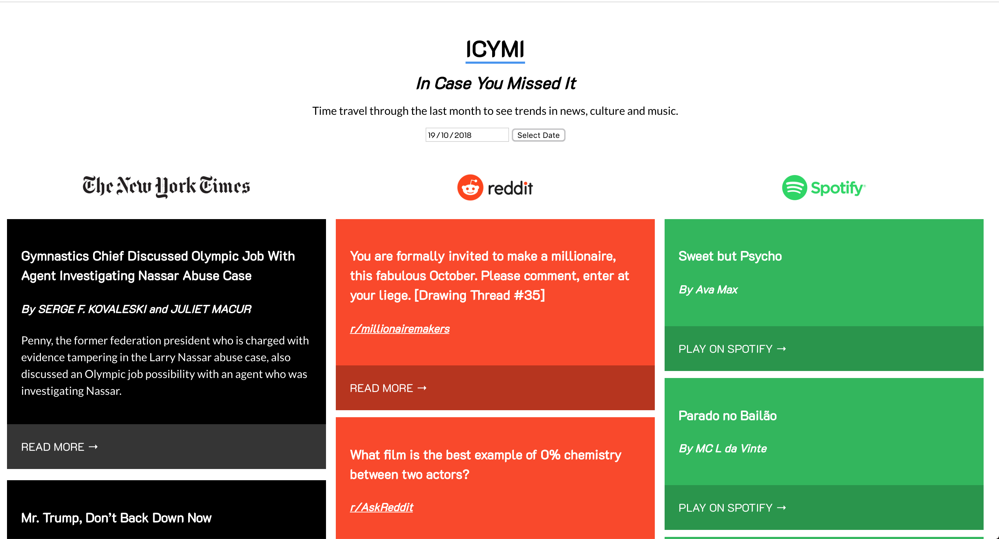

# ICYMI

[Project Link](https://lorenzoborje.github.io/icymi/)

## Summary

A dashboard for snapshots of trending news, culture and music. The user can select a date and see popular stories from the New York Times, the most commented thread on Reddit, and the top viral hits on Spotify, all on that date.

## Screenshots

## Technologies Used

* HTML
* CSS
* JavaScript
* jQuery

## Future Features

* More sources
* The ability to select sources to view
* Better cross-browser datepicker implementation

